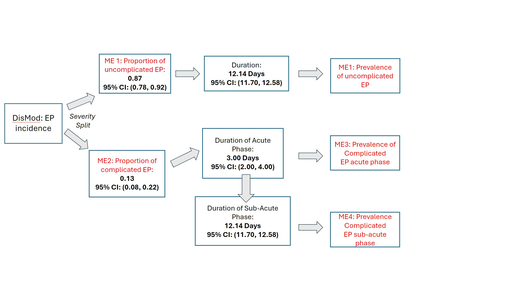

Modelers: Emily Desai (corbette@uw.edu) & Ke Pan (kepan@uw.edu)  
DA: Christian Hernandez (chrish47@uw.edu)  

<hr style="border:2px solid gray">

## **Live Birth Adjustment File Structure - 2024, Severity Splits**

<hr style="border:2px solid gray">

**(1)** Make sure you are on the cluster for this, and that have you have an R interactive session opened. Please see the HUB for more details.  
**(2)** Launch Script: submit_jobs_2024_Ectopic  
**(3)** Ectopic Pregnancy Code (Mechanics): maternal_code_ectopic  
**(4)** Saving Draw Results (Epiviz): save_ectopic  

<hr style="border:2px solid gray">

## **Ectopic Pregnancy, MEs Flow Chart**

<hr style="border:2px solid gray">

```
10485 - Ectopic Pregnancy 											[Incidence and Prevalence]  
28983 - Uncomplicated ectopic pregnancy (nonfatal)					[Incidence and Prevalence]  
28984 - Complicated ectopic pregnancy (incidence)					[Incidence]  
28985 - Complicated ectopic pregnancy (prevalence of acute phase)	[Prevalence]  
28986 - Complicated ectopic pregnancy (prevalence of sub-acute)		[Prevalence]  
```



<hr style="border:2px solid gray">

## **Ectopic class Procedural Summary**  

<hr style="border:2px solid gray">


**The base or main Ectopic class can be found in the maternal_code_ectopic script**
> Keep in mind that this class utilizes or depends on several helper functions with this same script.  

**1. Pull Incidence Draws**  
* Retrieves the incidence data required for further calculations.  

```
draws = self.pull_draws()
```

**2. Calculate New Incidence**  

* Retrieves age-specific fertility rates.  
* Calculates new incidence rates based on the draws and fertility rates.  
* Outputs the new incidence data.  

```
asfr = self.get_asfr()
new_inc = self.get_new_incidence(draws, asfr)
self.output(new_inc, output_me, 6)
```

**3. Calculate New Prevalence**  

* Creates duration draws for prevalence calculation.  
* Multiplies the new incidence data with the duration draws to get new prevalence.  
* Outputs the new prevalence data.  

```
duration = self.create_draws(0.0082, 0.0055, 0.0110)
new_prev = self.mul_draws(new_inc, duration)
self.output(new_prev, output_me, 5)
```

**4. Generate Severity Draws**  
* Generates draws for uncomplicated and complicated cases.  
* Adjusts the severity splits to ensure they are appropriately balanced.  

```
uncomplicated = self.create_draws(0.87, 0.78, 0.92)
complicated = self.create_draws(0.13, 0.08, 0.22)
uncomplicated, complicated = self.squeeze_severity_splits(uncomplicated, complicated)
```

**5. Generate Duration Draws for Severity Groups**  

* Creates log-normal duration draws for uncomplicated subacute and complicated acute cases.  

```
uncomplicated_subacute_dur = self.create_log_normal_draws(12.14 / 365, 11.7 / 365, 12.58 / 365)
complicated_acute_dur = self.create_log_normal_draws(3 / 365, 2 / 365, 4 / 365)
```

**6. Calculate Incidence for Severity Levels**  

* Multiplies new incidence with severity draws to get incidence for uncomplicated and complicated cases.  
* Outputs the incidence data for both uncomplicated and complicated cases.  

```
uncomplicated_inc = self.mul_draws(new_inc, uncomplicated)
complicated_inc = self.mul_draws(new_inc, complicated)
self.output(uncomplicated_inc, uncomplicated_seq_me, 6)
self.output(complicated_inc, complicated_inc_seq_me, 6)
```

**7. Calculate and Output Prevalence for Severity Levels**  

* Multiplies the incidence data with respective duration draws to get prevalence for uncomplicated, complicated acute, and complicated subacute cases.  
* Outputs the prevalence data for all severity levels.  

```
uncomplicated_prev = self.mul_draws(uncomplicated_inc, uncomplicated_subacute_dur)
complicated_acute_prev = self.mul_draws(complicated_inc, complicated_acute_dur)
complicated_subacute_prev = self.mul_draws(complicated_inc, uncomplicated_subacute_dur)
self.output(uncomplicated_prev, uncomplicated_seq_me, 5)
self.output(complicated_acute_prev, complicated_acute_prev_seq_me, 5)
self.output(complicated_subacute_prev, complicated_subacute_prev_seq_me, 5)
```

**Summary**  
The Ectopic class processes ectopic pregnancy data by performing the following steps:  
	1.	Pulls incidence data.  
	2.	Calculates new incidence based on ASFR.  
	3.	Calculates new prevalence using the incidence and duration.  
	4.	Generates severity-specific draws and adjusts them.  
	5.	Creates and outputs incidence and prevalence for different severity groups (uncomplicated and complicated).  
	6.	Outputs the results at each step.  

<hr style="border:2px solid gray">

**Ectopic Pregnancy, 2024 Outputs:** `/mnt/share/scratch/projects/rgud/Ectopic_Pregnancy_2024/nonfatal_maternal`  
> Look at the latest Folder
