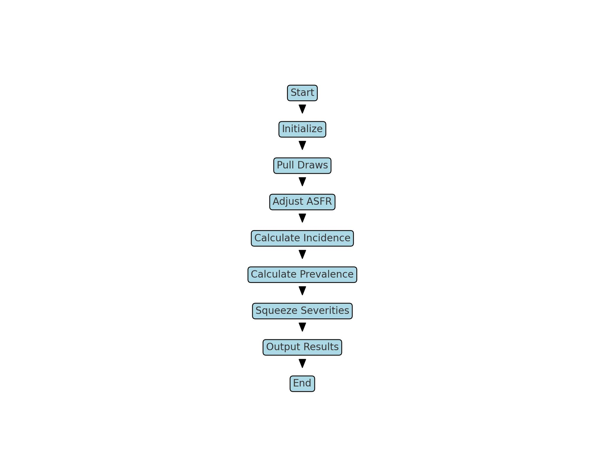
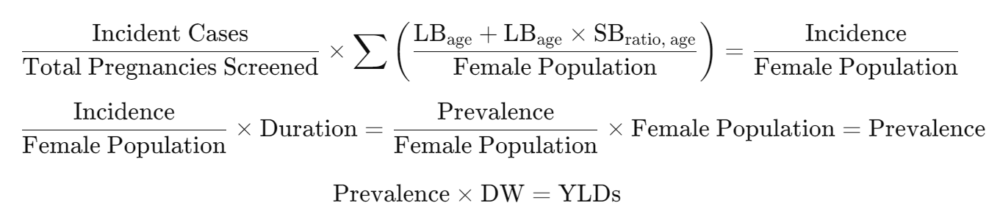

<details>
<summary>Click to expand !</summary>

**Modelers: Ke Pan(kepan@uw.edu) and Emily Desai(corbette@uw.edu) for Ectopic Pregnancy, Jenny Faith(jmfaith@uw.edu) for Maternal Causes, Sunny Lin(sunnypyl@uw.edu) for PPCM, and Rachael Bokota (rbokot@uw.edu) for GDM**  
**DA: Christian Hernandez (chrish47@uw.edu)**  

</details>

<hr style="border:2px solid gray">

## *How to run the Live Birth Adjustment Pipeline*  

<hr style="border:2px solid gray">

### *General Guidelines*
**1.** In order to run the live birth adjustment post-processing code, I would recommend submitting/requesting for a Jupyter session on the cluster, a notebook or lab. I would recommend a Jupyter lab. You should also be able to run this on Visual Code If you would like, just make sure to download the jupyter app extension first for easier adaptability.  

**2.** Please clone this repo, `git clone <repository_url>`

**3.** Navigate to `submit_jobs_2024.ipynb`  

### *Maternal Causes*
**1.** Ensure that the `dependency_map.csv` and `epi_ids.csv` files are updated with the correct IDs and names.
- The most commonly updated ID for every model, on a consistent basis, is the `crosswalk_version_id`. Please update this accordingly.
- Check in with the maternal modeler to confirm all IDs are accurate.

**2.** Run the 'Maternal Non-fatal Outcomes' section on `submit_jobs_2024.ipynb` to execute the live birth adjustment for all maternal causes.

**3.** Review the script and consult the provided documentation for further details.

### *GDM and/or PPCM*

**1.** Ensure that the `dependency_map_{cause}.csv` and `epi_ids_{cause}.csv` files are updated with the correct IDs and names.
- The most commonly updated ID for every model, on a consistent basis, is the `crosswalk_version_id`. Please update this accordingly.
- Check in with the maternal modeler to confirm all IDs are accurate.

**2.** Run the 'GDM and PPCM' section on `submit_jobs_2024.ipynb` to execute the live birth adjustment for all maternal causes.

**3.** Review the script and consult the provided documentation for further details.

<hr style="border:2px solid gray">

# Maternal Health Nonfatal Modeling Classes
* The following provides a breakdown of each of classes on `maternal_core.py`


## Overview

This README provides a detailed overview of the maternal health modeling classes, explaining their purpose and the functionality of the helper methods used within each class.

---

## 1. Abortion Class

The `Abortion` class is designed to model the incidence and prevalence of abortions. It inherits from the `Base` class and follows a typical structure for calculating health metrics.

### `__init__()`
- Initializes the class with parameters: `cluster_dir`, `year_id`, `input_me`, `output_me`, and `release_id`. These parameters set up the environment for pulling data and outputting results.

### `run()`
- **`pull_draws()`**: Retrieves probabilistic distributions or "draws" for the incidence of abortion.
- **`get_asfr()`**: Pulls the Age-Specific Fertility Rates (ASFR) to adjust incidence based on fertility data.
- **`get_new_incidence()`**: Calculates new incidence by combining the draws and ASFR.
- **`create_draws()`**: Generates draws for the duration of the condition based on predefined bounds.
- **`mul_draws()`**: Multiplies incidence and duration to compute prevalence.
- **`output()`**: Outputs incidence and prevalence with specific measure IDs.

---

## 2. Eptopic Class

The `Eptopic` class models the incidence and prevalence of ectopic pregnancies. It is nearly identical to the `Abortion` class.

### `__init__()`
- Initializes the class with the same parameters as `Abortion` (`cluster_dir`, `year_id`, `input_me`, `output_me`, `release_id`).

### `run()`
- **`pull_draws()`**: Pulls incidence data for ectopic pregnancies.
- **`get_asfr()`**: Retrieves ASFR for adjusting incidence.
- **`get_new_incidence()`**: Generates new incidence values.
- **`create_draws()`**: Generates duration draws for prevalence calculation.
- **`mul_draws()`**: Multiplies incidence and duration to compute prevalence.
- **`output()`**: Outputs incidence and prevalence data.

---

## 3. Hemorrhage Class

The `Hemorrhage` class models maternal hemorrhage with moderate and severe cases.

### `__init__()`
- Initializes the class with `mod_seq_me` and `sev_seq_me`, which represent moderate and severe sequence models.

### `run()`
- **`pull_draws()`**: Pulls incidence draws.
- **`get_asfr()`**: Retrieves ASFR data.
- **`get_new_incidence()`**: Generates new incidence values.
- **`create_draws()`**: Creates severity and duration draws for moderate and severe cases.
- **`squeeze_severity_splits()`**: Ensures severity proportions sum to 1.
- **`mul_draws()`**: Calculates moderate and severe incidence/prevalence.
- **`output()`**: Outputs moderate and severe incidence and prevalence.

---

## 4. PPCM Class (Old protocol  - Using maternal_core.py)

The `PPCM` class models Peripartum Cardiomyopathy (PPCM) with four severity categories: controlled, mild, moderate, and severe.

### `__init__()`
- Initializes the class with four severity categories (`control_seq_me`, `mild_seq_me`, `mod_seq_me`, `sev_seq_me`).

### `run()`
- **`pull_draws()`**: Pulls incidence draws.
- **`get_asfr()`**: Retrieves ASFR for incidence adjustment.
- **`get_new_incidence()`**: Generates new incidence values.
- **`create_draws()`**: Creates draws for four severity categories.
- **`squeeze_severity_splits_PPCM()`**: Ensures severity proportions for PPCM sum to 1.
- **`create_log_normal_draws()`**: Generates duration draws for each severity level.
- **`mul_draws()`**: Multiplies incidence by severity proportions and durations.
- **`output()`**: Outputs incidence and prevalence for each severity category.

---

## 5. Eclampsia Class

The `Eclampsia` class models maternal eclampsia and long-term sequelae.

### `__init__()`
- Initializes the class with the additional parameter `lt_seq_me` for long-term sequelae.

### `run()`
- **`pull_draws()`**: Pulls incidence draws for eclampsia.
- **`get_asfr()`**: Retrieves ASFR data.
- **`get_new_incidence()`**: Generates new incidence values.
- **`create_draws()`**: Creates draws for prevalence and long-term sequelae.
- **`data_rich_data_poor()`**: Splits data into rich and poor categories, applying different severity proportions.
- **`mul_draws()`**: Calculates long-term sequelae incidence.
- **`output_for_epiuploader()`**: Outputs formatted long-term sequelae data.

---

## 6. Hypertension Class

The `Hypertension` class models maternal hypertension, including severe preeclampsia and long-term sequelae.

### `__init__()`
- Includes parameters like `sev_input_me`, `other_seq_me`, and `lt_seq_me`.

### `run()`
- **`pull_draws()`**: Pulls incidence draws for hypertension.
- **`get_asfr()`**: Retrieves ASFR data.
- **`get_new_incidence()`**: Generates new incidence values.
- **`output()`**: Outputs incidence for hypertension.
- **`scale_rows()`**: Adjusts proportions for other hypertensive conditions.
- **`squeeze_severity_splits()`**: Squeezes severity proportions.
- **`mul_draws()`**: Calculates long-term sequelae and prevalence.
- **`output()`**: Outputs prevalence for both severe and other hypertensive conditions.

---

## 7. Obstruct Class

The `Obstruct` class models obstructed labor.

### `__init__()`
- Initializes the class with standard input parameters.

### `run()`
- **`pull_draws()`**: Pulls incidence draws.
- **`get_asfr()`**: Retrieves ASFR data.
- **`get_new_incidence()`**: Generates new incidence values.
- **`create_draws()`**: Generates duration draws for prevalence calculation.
- **`mul_draws()`**: Multiplies incidence and duration to compute prevalence.
- **`output()`**: Outputs incidence and prevalence.

---

## 8. Fistula Class

The `Fistula` class models vesicovaginal and rectovaginal fistulas.

### `__init__()`
- Initializes the class with the additional parameter `recto_seq_me`.

### `run()`
- **`pull_draws()`**: Pulls incidence and prevalence draws for fistulas.
- **`create_draws()`**: Creates proportions for vesicovaginal and rectovaginal fistulas.
- **`squeeze_severity_splits()`**: Ensures proportions sum to 1.
- **`mul_draws()`**: Calculates incidence and prevalence for both fistula types.
- **`output()`**: Outputs incidence and prevalence data.

---

## 9. Zero_Fistula Class

The `Zero_Fistula` class models a scenario where fistula incidence and prevalence are assumed to be zero.

### `__init__()`
- Initializes the class with standard input parameters.

### `run()`
- **`pull_draws()`**: Pulls incidence and prevalence draws.
- **`zero_locs()`**: Sets incidence and prevalence values to zero where fistulas are not present.
- **`output()`**: Outputs the zeroed incidence and prevalence data.

---

## 10. Sepsis Class

The `Sepsis` class models maternal sepsis, including infertility as a long-term outcome.

### `__init__()`
- Includes an additional parameter, `infertile_me`, to track infertility metrics.

### `run()`
- **`pull_draws()`**: Pulls incidence draws for sepsis.
- **`get_asfr()`**: Retrieves ASFR data.
- **`get_new_incidence()`**: Generates new incidence values.
- **`create_draws()`**: Creates duration draws for prevalence and infertility severity.
- **`mul_draws()`**: Calculates prevalence and infertility incidence.
- **`output_for_epiuploader()`**: Outputs formatted infertility data.

---

## 11. SepsisOther Class

The `SepsisOther` class models a different subtype of maternal sepsis.

### `__init__()`
- Initializes the class with fewer parameters.

### `run()`
- **`pull_draws()`**: Pulls incidence draws.
- **`get_asfr()`**: Retrieves ASFR data.
- **`get_new_incidence()`**: Generates new incidence values.
- **`create_draws()`**: Generates duration draws for prevalence calculation.
- **`mul_draws()`**: Calculates prevalence.
- **`output()`**: Outputs incidence and prevalence data.

---

## 12. PPCM Class (Using the Protocol(from Sunny / MRBRT) - Using maternal_core_ppcm.py)

The `PPCM` class is designed to model Peripartum Cardiomyopathy (PPCM), a condition affecting pregnant women. It handles the processing of incidence and prevalence data across different severity levels of the condition. The severity is categorized into four groups: controlled, mild, moderate, and severe.

### `__init__(self, cluster_dir, year_id, input_me, output_me, control_seq_me, mild_seq_me, mod_seq_me, sev_seq_me, release_id, location_name)`
This method initializes the class with various parameters such as:
- `cluster_dir`: Directory path for storing the data.
- `year_id`: The year for which the data is being processed.
- `location_name`: Specifies the location for data retrieval and processing.

#### `run(self)`
This is the primary function that processes the PPCM data. It executes the following steps:
- **`pull_draws()`**: Retrieves PPCM incidence data for different severity levels using simulation draws.
- **`get_asfr()`**: Fetches Age-Specific Fertility Rates (ASFR) to adjust incidence data based on fertility rates.
- **`get_new_incidence()`**: Combines the incidence and ASFR data to generate new incidence estimates for PPCM.
- **`squeeze_severity_splits_PPCM()`**: Ensures that severity proportions (controlled, mild, moderate, severe) sum to 1 for consistency.
- **`create_log_normal_draws()`**: Generates duration draws for each severity category using a log-normal distribution.
- **`mul_draws()`**: Multiplies incidence values by severity proportions and durations to calculate the final incidence and prevalence for each category.
- **`output()`**: Outputs both incidence and prevalence data for each severity category, saved with appropriate measure IDs (6 for incidence and 5 for prevalence).

### File Handling
- The class reads Excel files containing data for each severity category (`control`, `mild`, `moderate`, `severe`) and processes these files into NumPy arrays for computational use.
- File paths are constructed dynamically based on `location_name` to retrieve the correct data files.

## Recent Changes (from 10/04 update)

### Severity and Duration Draws
- **Severity Draw Files**: 
  - Stored in logit space and categorized by **NYHA (New York Heart Association) categories**. Each of these NYHA files were converted into linear space. Each Super region group had all four NYHA files, filtered by its prescribed Super region.
  
- **Duration Draw Files**: 
  - Stored in log space and separated by the same super region groupings as with severity draws. Also, as with severity groups, the duration file was converted into linear spce. Each super region had this file, filtered by its prescribed Super region. Previously, durations were hardcoded, but now draw files provide duration data dynamically.

* You can use the ppcm_mrbrt_file_code script to prep the data.

### File Locations
- The updated draw files are stored in the following directory: `/mnt/team/rgud/pub/users/sunnypyl/for_Christian/postprocessing_1004update`  
* You can also access these files by cloning this repo. [postprocessing_1004update]

* Ask the PPCM modeler if these NYHA and Duration draw files have been updated. If they have, you need to update these files and the maternal_core_ppcm.py script accordingly.


* IT IS VERY IMPORTANT THAT YOU FOLLOW THE SAME FILE STRUCTURED AS PRESSENTED IN [postprocessing_1004update]
  

---


## 13. GDM Class

The `GDM` class models Gestational Diabetes Mellitus (GDM) and calculates both its prevalence and incidence.

### `__init__()`
- Initializes the class with parameters: `cluster_dir`, `year_id`, `input_me`, `output_me`, and `release_id`.

### `run()`
- **`pull_draws_gdm()`**: Pulls incidence draws specifically for GDM.
- **`get_asfr()`**: Retrieves age-specific fertility rates (ASFR) for live births.
- **`get_sb_ratio()`**: Retrieves the ratio of stillbirths to live births.
- **`get_female_pop()`**: Retrieves the total female population to adjust prevalence and incidence calculations.
- **`get_new_incident_gdm_new()`**: Creates new incidence values for GDM by combining the incidence draws, ASFR, stillbirth ratio, and female population.
- **`create_draws()`**: Generates duration draws, defined as a range from 16 to 20 weeks (in years).
- **`mul_draws()`**: Multiplies the incidence by the duration to calculate prevalence, rather than dividing as in the previous version.
- **`output()`**: Outputs the new incidence and prevalence data for GDM with measure IDs (6 for incidence, 5 for prevalence).



### In the script(GDM class), using the above formula, the sum was conducted using the following logic:  

This is for live birth+stillbirth:    
* `Asfr*46/52*pop is for live birth`  
* `Stillbirth_livebirth_ratio*asfr*pop*26/52 is for stillbirth`  


#### Weighted Formula:
The formula is a weighted combination of two components:

1. **Live births component**: `(46/52)` is used to scale the effect based on live births.
2. **Stillbirths component**: `(26/52)` scales the effect based on stillbirths, taking into account the stillbirth ratio (`sb_ratio`).

#### Expression breakdown:
- **First part**: `new_incidence['asfr'] * (46/52) * new_incidence['female_population']`
  - Calculates incidence for live births by multiplying ASFR with the fraction for live births `(46/52)` and the female population.
  
- **Second part**: `new_incidence['sb_ratio'] * new_incidence['asfr'] * new_incidence['female_population'] * (26/52)`
  - Similar to the first part but for stillbirths, multiplied by `sb_ratio` and the fraction for stillbirths `(26/52)`.

#### Division by Female Population:
The resulting sum of the two components is divided by the total female population (`new_incidence['female_population']`) to normalize the result on a per-population basis.

#### Final Multiplication:
The value calculated from the weighted formula is then multiplied by each respective `draw_col` value in the `new_incidence` DataFrame.


**Description:**
```
The updated GDM class follows a similar workflow as the original but includes significant modifications in how incidence and prevalence are calculated. The new method for calculating incidence incorporates age-specific fertility rates (ASFR) and the stillbirth-to-live-birth ratio. The incidence draws are pulled with pull_draws_gdm(), and these are combined with the ASFR, stillbirth ratio, and female population using get_new_incident_gdm_new().

For prevalence, the class calculates duration draws with create_draws() based on a range of 16 to 20 weeks, converted into years. Instead of dividing the prevalence by the duration (as was done previously), the incidence is multiplied by the duration using mul_draws() to calculate new prevalence. The resulting prevalence and incidence data are outputted with the respective measure IDs for prevalence (5) and incidence (6).

This updated approach enhances the flexibility of incidence and prevalence calculations, integrating additional factors such as fertility rates and stillbirth ratios, and modifying the way duration is applied to the calculations.
```

**Notes:**
```
GDM incidence and prevalence are now adjusted by additional factors, including the age-specific fertility rate (ASFR) and stillbirth-to-live-birth ratio. These adjustments help refine the incidence and prevalence estimates by incorporating live birth and stillbirth data.

Prevalence is calculated using a new method that multiplies incidence by duration, rather than dividing. This change reflects a shift in how prevalence is modeled, potentially offering more precise estimates of GDM prevalence.
```


